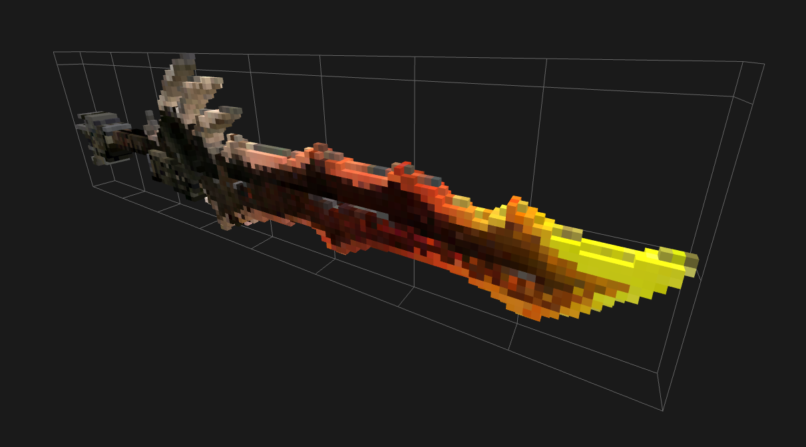

# obj2voxel

image::https://github.com/Eisenwave/obj2voxel/actions/workflows/linux.yml/badge.svg[linux,link=https://github.com/Eisenwave/obj2voxel/actions/workflows/linux.yml]
image::https://github.com/Eisenwave/obj2voxel/actions/workflows/windows.yml/badge.svg[linux,link=https://github.com/Eisenwave/obj2voxel/actions/workflows/windows.yml]



**obj2voxel** is a command-line voxelizer for Wavefront OBJ files.
It uses link:https://github.com/tinyobjloader/tinyobjloader[tinyobj] for loading OBJ files and link:https://github.com/Eisenwave/voxel-io[voxel-io] for writing voxel models.

## Installation

Download the link:https://github.com/eisenwave/obj2voxel/releases[latest release] executable.
There are prebuilt binaries for Windows and Linux.
Or, if you want to build from source, proceed as follows (on Linux):

```sh
mkdir build
cd build
cmake ..
make         # optionally with -j <number of threads> option for multithreaded compile
```
After installing, the executable will be in your `build` directory.

## Usage

```sh
# Usage
./obj2voxel input_file output_file -r <resolution> # other options ...

# Example
./obj2voxel in.obj out.qef -t texture.png -r 128 -s max
```

### General Options

.`-h/--help`
[%collapsible]
====
Displays the help menu.
The help menu is also displayed if not enough options were provided.
====

.`--80`
[%collapsible]
====
Enables 80-column displaying of the help menu.
By default, more columns than 80 may be printed which may not be compatible with your terminal.
====

.`-V/--version`
[%collapsible]
====
Enables verbose logging.
Time stamps, source code locations and debug messages will be displayed.
====

.`-v/--verbose`
[%collapsible]
====
Displays information about the current obj2voxel version and a list of builtins which the program was compiled with.
The builtins list is largely irrelevant to the user but can be helpful information for maintainers.
====


### File Options

.`input_file` (required)
[%collapsible]
====
The relative or absolute path to the input file.
Depending on the extension `.stl` or `.obj` a different input format is chosen.
If the file type can't be detected, the default is Wavefront OBJ.
====
 
.`output_file` (required)
[%collapsible]
====
The relative or absolue path to the output file.
Depending on the extension `.ply`, `.qef`, etc. a different output format is chosen.
Check the list of supported formats.
There is no default so obj2voxel fails if the file type can't be identified by its extension.
====

.`-i (obj|stl)`
[%collapsible]
====
The explicit input format.
This allows specifying an extension such as `obj` or `stl` explictly for files with no extension.
By default, this is not necessary.
====

.`-o (ply|qef|vl32|vox|xyzrgb)`
[%collapsible]
====
The explicit output format.
This allows specifying an extension such as `qef` or `vox` explictly for files with no extension.
By default, this is not necessary.
====

.`-t <texture>`
[%collapsible]
====
The optional path to a texture file.
This texture is used for triangles with UV coordinates but no materials.
There are some models which don't have material libraries at all.
This option is very useful for those types of models.
====

### Voxelization Options

.`-r/--res <resolution>` (required)
[%collapsible]
====
The voxel grid resolution.
This is a maximum for all axes, meaning that a non-cubical model will still fit into this block.
The output model will be at most r³ voxels large.
====

.`-s/--strat (max|blend)`
[%collapsible]
====
The coloring strategy for when multiple triangles occupy one voxel.
The default strategy is `max`.
When voxelizing, weighted colors are produced where the weights are the areas of the triangle sections inside of a
voxel.

* `max` means that the greatest triangle section is chosen for the color of a voxel.
  Max produces sharper colors and doesn't introduce any colors that weren't in the original mesh.
  However, at low resolutions, it can look noisy and small details from the mesh might disappear.
* `blend` means that triangle sections will be blended together using their weights.
  Blend produces smoother colors and reproduces smaller details at least somewhat.
  However, it introduces new colors and can make the model look blurry.
  For example, blend would produce a magenta edge between a red and blue triangle which might be unwanted.

**Example 1:** "Spot" model. `max` is left, `blend` is right. +


**Example 2:** "Sword" model. `blend` is top, `max` is bottom. +

====

.`-p/--perm <permutation>`
[%collapsible]
====
The axis permutation and optionally, axis flipping.
The default is `xyz`; another order such as `xzy` may be specified to reorder axes.
Capital letters flip axes.
For example, for `xYz` the y-axis is flipped.
This is useful for importing models from software where a different axis is being used for "up".
====

.`-u/--super`
[%collapsible]
====
Enables 2x supersampling.
The model is voxelized at double resolution and then downscaled.
Supersampling will usually produce slightly more voxels.

Supersampling can improve color accuracy by voxelizing at a higher resolution and blending multiple voxels.
In this comparison, the right cow is supersampled: +

====

.`-j/--threads <threads>`
[%collapsible]
====
The number of worker threads to be started.
obj2voxel supports parallelism and if `threads` is not zero, worker threads will be started that voxelize many triangles simultaneously.
This option is set to the number of hardware threads by default.
You can also set it exactly to `0`, which disables paralellism completely.
Setting it to `1` is usually pointless and ends up being slower than just using `-j 0`.
====

### Usage Example

A usual run of obj2voxel looks like this: +
image:img/terminal_screenshot.png[screenshot]
  
## Supported Formats

[cols="2,1,1"]
|===================================================
| Name | Extension | Purpose

| Wavefront OBJ
| `obj` | Input

| Stereolithography
| `stl` | Input

| Stanford Triangle
| `ply` | Output

| Qubicle Exchange Format
| `qef` | Output

| Magica Voxel
| `vox` | Output&ast;

| VL32
| `vl32` | Output

| XYZRGB
| `xyzrgb`| Output&ast;&ast;
|===================================================

### Notes

.**Stanford Triangle (PLY)**
[%collapsible]
====
The exported PLY files are point clouds consisting of vertices with integer coordinates:
```cpp
ply
format binary_big_endian 1.0
element vertex ...
property int x
property int y
property int z
property uchar alpha
property uchar red
property uchar green
property uchar blue
end_header
```
voxel-io works with signed positions which is why `int` is used instead of `uint`, but the positions exported are always
positive.
====

.**VL32**
[%collapsible]
====
VL32 is a format used only by voxel-io.
It's simply an array of `(x,y,z,argb)` 32-bit big-endian integer quadruples.
VL32 is bit-identical to the PLY files exported by obj2voxel when the first **300** header bytes are removed.
It is always exactly 300 bytes, the voxel-io library makes sure of that.

To read a VL32 file, implement the following pseudo-code:
```cpp
while (not end_of_file_reached()) {
    int32_t x = read_big_endian_int32();
    int32_t y = read_big_endian_int32();
    int32_t z = read_big_endian_int32();
    uint8_t a = read_byte();
    uint8_t r = read_byte();
    uint8_t g = read_byte();
    uint8_t b = read_byte();
}
```
====

.**Magica Voxel (VOX)**
[%collapsible]
====
VOX support is still experimental; writing the file in the end can take a long time because building a 255-color palette is somewhat inefficient.
Use of streamable formats like VL32 is highly recommended, only use VOX for lower resolutions.
====

.**XYZRGB**
[%collapsible]
====
XYZRGB's official extension is `xyzrgb` but the software link:https://github.com/Zarbuz/FileToVox[_FileToVox_] uses the extension `xyz` instead. Rename the files before importing into _FileToVox_.
====

## Performance

On high-end hardware and with some models, obj2voxel can produce 10 million voxels per second.
Voxelization is a highly parallel task and scales very well with high thread counts.
Any resolution lower than 1024 should be voxelized almost instantly, even with a single thread.

The memory consumption of obj2voxel depends on the size of the input model because the model is loaded into memory entirely.
Certain output formats like PLY, VL32 and XYZRGB can be streamed, meaning that obj2voxel will consume very little memory when producing them.
Other formats like QEF require a palette to be constructed, so all voxels must be buffered in memory before they can be written.
This usally requires around 16 bytes per voxel.

The aforementioned streamable formats don't require this and because obj2voxel has a chunk-based approach to voxelization, the memory consumption will be very low.
Even voxelizing at 8192 resolution might require only 100MB.

## Approach

In case you're curious how obj2voxel voxelizes models:

1. Triangles are first transformed from model space to voxel grid space.
2. Triangles are then subdivided into smaller triangles if their bounding boxes are large.
   This reduces the number of wasted iterations in the next step.
3. For every voxel in the bounding box of the triangle, the triangle is cut at the six bounding planes of the voxel.
   If some portion of the subtriangle remains inside the voxel after all six cuts, the triangle is converted into a pair of weight and color.
   Otherwise, the triangle does not interesect the voxel.
   The weight is the area of the triangle and the color is the material color at the center of the triangle.
4. Colors from multiple triangles are blended together using either `max` or `blend` modes.
