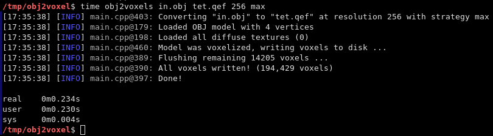

# obj2voxel


**obj2voxel** is a command-line voxelizer for Wavefront OBJ files.
It uses [tinyobj](https://github.com/tinyobjloader/tinyobjloader) for loading OBJ files and [voxel-io](https://github.com/Eisenwave/voxel-io) for writing voxel models.

## Supported Formats

- **Wavefront OBJ** (Read)
- **QEF** (Write)
- **VL32** (Write)

Note: VL32 is a format used only by voxel-io.
It's simply an array of (x,y,z,argb) 32-bit big-endian integers.

## Installation

Linux:
```sh
mkdir build
cd build
cmake ..
make         # optionally with -j <number of threads> option for multithreaded compile
```

## Usage

```
# Usage
obj2voxel <in_file:path> <out_file:path> <resolution:uint> [color_strat:(max|blend)=max]

# Example
obj2voxel in.obj out.qef 128 max
```

**Explanation:** obj2voxel takes only positonal arguments:

- `in_file` is the relative or absolute path to the input file
- `out_file` is the relative or absolue path to the output file. Depending on the extension `qef` or `vl32` a different output format is chosen.
- `resolution` is the maximum voxel grid resolution on any axis.
- `color_strat` is a coloring strategy for when multiple triangles occupy one voxel.
  `max` means that the greatest triangle section is chosen for coloring.
  `blend` means that the different triangle sections will be blended together using their areas in the voxel as weights.
  
A usual run of obj2voxel looks like this:

