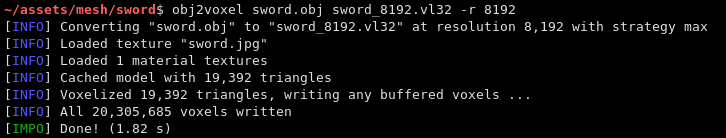

# obj2voxel


**obj2voxel** is a command-line voxelizer for Wavefront OBJ files.
It uses [tinyobj](https://github.com/tinyobjloader/tinyobjloader) for loading OBJ files and [voxel-io](https://github.com/Eisenwave/voxel-io) for writing voxel models.

## Installation

Download the [latest release](https://github.com/eisenwave/obj2voxel/releases) executable.
There are prebuilt binaries for Windows and Linux.
Or, if you want to build from source, proceed as follows (on Linux):

```sh
mkdir build
cd build
cmake ..
make         # optionally with -j <number of threads> option for multithreaded compile
```
After installing, the executable will be in your `build` directory.

## Usage

```sh
# Usage
./obj2voxel input_file output_file -r <resolution> # ...

# Example
./obj2voxel in.obj out.qef -t texture.png -r 128 -s max
```

##### `input_file`
is the relative or absolute path to the input file.
Depending on the extension `.stl` or `.obj` a different input format is chosen.
If the file type can't be detected, the default is Wavefront OBJ.
  
##### `output_file`
is the relative or absolue path to the output file.
Depending on the extension `.ply`, `.qef`, etc. a different output format is chosen.
Check the list of supported formats.
There is no default so obj2voxel fails if the file type can't be identified by its extension.

##### `-r <resolution>`
is the voxel grid resolution.
This is a maximum for all axes, meaning that a non-cubical model will still fit into this block.
The output model will be at most r³ voxels large.

**Example:** `-r 128`

##### `-s (max|blend)`
is a coloring strategy for when multiple triangles occupy one voxel.
See below for more details on how this option impacts the voxels.
The default is `max`.

**Example:** `-s blend`

##### `-t <texture>`
is the optional path to a texture file.
This texture is used for triangles with UV coordinates but no materials.
There are some models which don't have material libraries at all.
This option is very useful for those types of models.

**Example:** `-t path/to/texture.png`

##### `-p <permutation>`
is the axis permutation.
The default is `xyz`; another order such as `xzy` may be specified to reorder axes.
This is useful for importing models from software where a different axis is being used for "up".

**Example:** `-p xzy`

##### `-u`
enables 2x supersampling.
The model is voxelized at double resolution and then downscaled.
See below for more details.

A usual run of obj2voxel looks like this:


### Max vs Blend Strategies

There are two strategies for combining colors in a voxelized model.
When voxelizing, weighted colors are produced where the weights are the areas of the triangle sections inside of a
voxel.

- `max` means that the greatest triangle section is chosen for the color of a voxel.
  Max produces sharper colors and doesn't introduce any colors that weren't in the original mesh.
  However, at low resolutions, it can look noisy and small details from the mesh might disappear.
- `blend` means that triangle sections will be blended together using their weights.
  Blend produces smoother colors and reproduces smaller details at least somewhat.
  However, it introduces new colors and can make the model look blurry.
  For example, blend would produce a magenta edge between a red and blue triangle which might be unwanted.

**Example 1:** "Spot" model. `max` is left, `blend` is right.<br>


**Example 2:** "Sword" model. `max` is bottom, `blend` is top.<br>


Supersampling can also improve color accuracy by voxelizing at a higher resolution and blending multiple voxels.
In this comparison, the right cow is supersampled:<br>


Supersampling will usually produce slightly more voxels.
  
## Supported Formats

- **Wavefront OBJ** (Read)
- **STL (Stereolithography)** (Read)
- **QEF** (Write)
- **VL32** (Write)
- **PLY** (Write)
- **XYZRGB** (Write)

### PLY

The exported PLY files are point clouds consisting of vertices with integer coordinates:
```ply
ply
format binary_big_endian 1.0
element vertex ...
property int x
property int y
property int z
property uchar alpha
property uchar red
property uchar green
property uchar blue
end_header
```
voxel-io works with signed positions which is why `int` is used instead of `uint`, but the positions exported are always
positive.

### VL32

VL32 is a format used only by voxel-io.
It's simply an array of `(x,y,z,argb)` 32-bit big-endian integer quadruples.
VL32 is bit-identical to the PLY files exported by obj2voxel when the first **300** header bytes are removed.
It is always exactly 300 bytes, the voxel-io library makes sure of that.

To read a VL32 file, implement the following pseudo-code:
```cpp
while (not end_of_file_reached()) {
    int32_t x = read_big_endian_int32();
    int32_t y = read_big_endian_int32();
    int32_t z = read_big_endian_int32();
    uint8_t a = read_byte();
    uint8_t r = read_byte();
    uint8_t g = read_byte();
    uint8_t b = read_byte();
}
```

## Performance

obj2voxel can produce up to one million voxels per second in optimal circumstances.
Any resolution lower than 1000 should be voxelized almost instantly.

The maximum memory consumption is about 64 bytes per voxel.

## Approach

In case you're curious how obj2voxel voxelizes models:
1. Triangles are first transformed from model space to voxel grid space.
2. Triangles are then subdivided into smaller triangles if their bounding boxes are large.
   This reduces the number of wasted iterations in the next step.
3. For every voxel in the bounding box of the triangle, the triangle is cut at the six bounding planes of the voxel.
   If some portion of the subtriangle remains inside the voxel after all six cuts, the triangle is converted into a pair of weight and color.
   Otherwise, the triangle does not interesect the voxel.
   The weight is the area of the triangle and the color is the material color at the center of the triangle.
4. Colors from multiple triangles are blended together using either `max` or `blend` modes.
